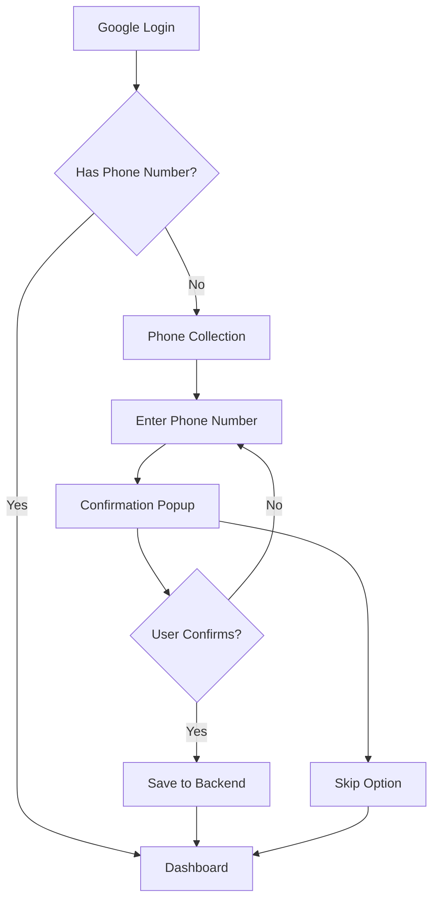

# Simplified Phone Collection System ✅

## Current Implementation: Simple Phone Collection

🎯 **The authentication system now uses a simplified phone collection approach:**

## How It Works

### For First-Time Users:
1. **Google Login** → User authenticates with Google OAuth ✅
2. **Phone Collection Page** → User enters phone number in international format
3. **Confirmation Popup** → User confirms their phone number is correct
4. **Backend Storage** → Phone number saved to database
5. **Dashboard Access** → User proceeds to authenticated area

### For Returning Users:
- **Direct Access** → Users with saved phone numbers go straight to dashboard
- **No Re-asking** → Phone number is never requested again after first setup

## Key Features

### Simplified User Experience
✅ **No SMS Verification** → No dependency on Firebase phone authentication  
✅ **No OTP Codes** → No SMS costs or complexity  
✅ **One-time Setup** → Phone number collected only once  
✅ **Confirmation Step** → Users can verify their number before saving  
✅ **Skip Option** → Users can skip phone collection if desired  

### Technical Implementation
- **Phone Validation** → International format validation (+1234567890)
- **Backend Storage** → Phone numbers saved via `/auth/update-phone` endpoint
- **Session Management** → Secure HTTP-only cookies for authentication
- **Clean UI** → Simple, intuitive phone collection interface

## Authentication Flow

## Removed Components

❌ **OTP/SMS Logic** → All Firebase phone authentication removed  
❌ **Rate Limiting** → No longer needed for OTP endpoints  
❌ **reCAPTCHA** → Not required for simple phone collection  
❌ **Phone Login** → Users cannot login with phone numbers  
❌ **SMS Costs** → No Firebase SMS charges  

## Current API Endpoints

✅ **Active Endpoints:**
- `POST /auth/google-login` → Google OAuth authentication
- `POST /auth/update-phone` → Save phone number
- `GET /auth/me` → Get current user info
- `POST /auth/logout` → User logout

❌ **Removed Endpoints:**
- `POST /auth/send-otp` → OTP sending (removed)
- `POST /auth/verify-otp` → OTP verification (removed)

## Files Modified

### Frontend Changes:
- **PhoneCollection.tsx** → Simplified to confirmation popup flow
- **api.ts** → Removed OTP-related API calls
- **page.tsx** → Removed PhoneSignIn component
- **Removed imports** → No more Firebase OTP dependencies

### Backend Changes:
- **auth.py** → Removed OTP endpoints, kept phone update endpoint
- **Removed imports** → No more rate limiter dependencies
- **Simplified logic** → Only phone number storage, no verification

## Benefits of This Approach

1. **Cost Effective** → No SMS charges from Firebase
2. **Simple Setup** → No Firebase phone authentication configuration needed
3. **Better UX** → No waiting for SMS, no code entry
4. **Reliable** → No dependency on SMS delivery
5. **Fast** → Immediate phone number collection and confirmation

## Security Considerations

- **Session Management** → Still uses secure Firebase session cookies
- **Input Validation** → Phone number format validation maintained
- **Authentication** → Google OAuth provides primary security
- **Data Storage** → Phone numbers stored securely in backend

The system now provides a streamlined, cost-effective way to collect phone numbers from users without the complexity of SMS verification. Perfect for applications that need contact information but don't require phone number verification. 🚀