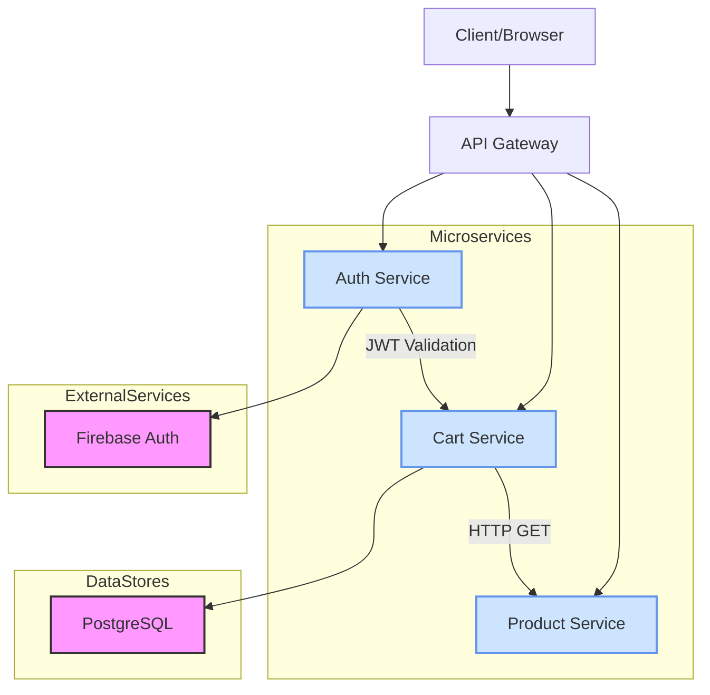

# Cart Microservice Flow Diagram

This diagram illustrates the communication flow between the Cart microservice and other services in the system.

## Service Communication Details

### 1. Authentication Flow
1. Client sends request with JWT token to API Gateway
2. API Gateway forwards request to Auth Service for token validation
3. Auth Service validates token with Firebase Auth
4. Auth Service returns user information to API Gateway
5. API Gateway forwards request with user info to Cart Service

### 2. Product Information Flow
1. Cart Service receives request to add/view cart items
2. Cart Service makes HTTP GET request to Product Service
3. Product Service queries PostgreSQL database
4. Product Service returns product details to Cart Service
5. Cart Service processes and returns response to API Gateway

### 3. Cart Operations Flow
1. Client requests cart operation (add/remove/clear)
2. API Gateway routes request to Cart Service
3. Cart Service validates user authentication
4. Cart Service performs database operations on PostgreSQL
5. Cart Service communicates with Product Service for product details
6. Cart Service returns updated cart information